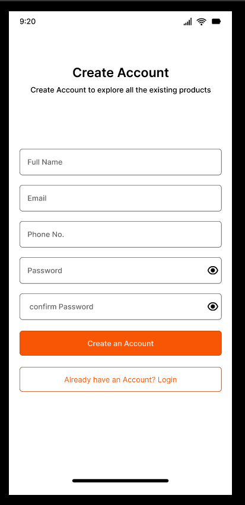
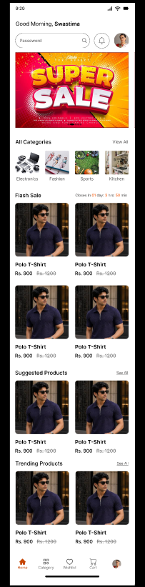
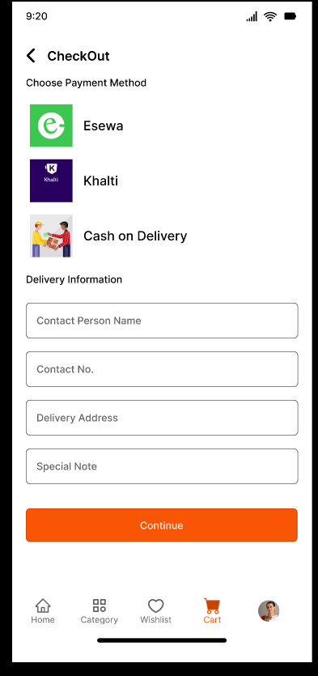

#  E‑Commerce Mobile App UI/UX Design

## Overview
This repository contains the design and prototype of a mobile e‑commerce application created in Figma.  
The goal is to provide a smooth shopping experience with clear navigation, intuitive flows, and integrated payment options.

---

##  Features Covered
-   Sign up & login flow  
-   Product browsing and categories  
-   Product detail pages  
-   Cart management  
-   Payment integration (e.g., Khalti, card options)  
-   Order success   

---

##  Tools & Design System
- **Design Tool:** Figma  
- **Pages:** Wireframing, Components, Design System, Final Design  
- **Focus:** Usability, clarity, and responsive mobile layouts  

---

##  Demo & Screenshots
- **Video Walkthrough:** [Link to demo video](#)  
- **Screenshots:**  
  -   
  - 
  -   
  -       

---

##  Future Improvements
- Dark mode support  
- Enhanced product detail interactions  
- Additional payment gateways  
- Refined order tracking UI  

---

##  Author
Designed and documented by **Samikshya Mishra**  
- LinkedIn: [https://www.linkedin.com/in/samikshya-mishra-212961313/](#)    

---

##  License
This project is licensed under the MIT License — feel free to explore and learn from it.
